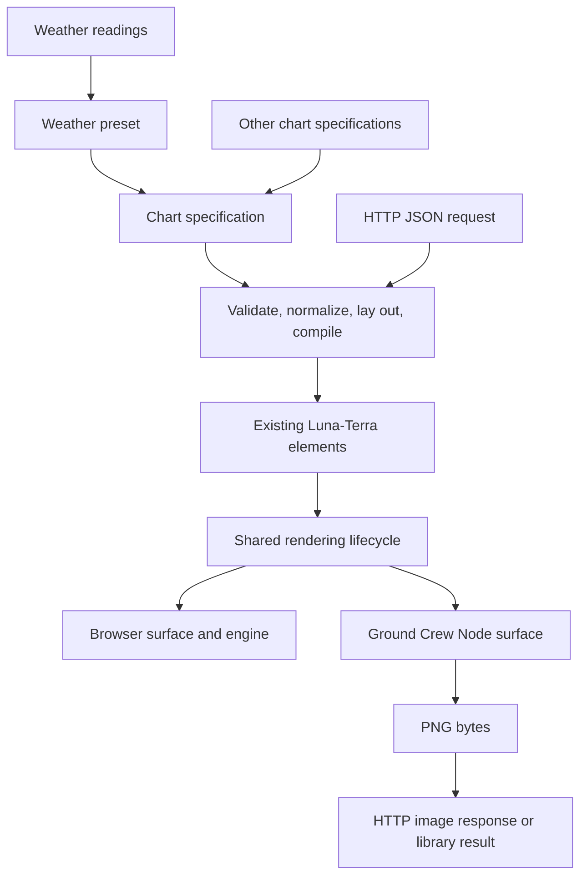

# Ground Crew: server rendering and declarative weather charts

Status: initial implementation complete on branch `feat/ground-crew-rendering-plan`. This document records the original detailed plan; the package READMEs describe the implemented API.

The plan covers two new packages, changes to shared rendering and chart primitives, and a weather example. Release and deployment remain future work.

## 1. Intended result and planning defaults

A Node.js application can pass a declarative chart specification to Luna-Terra and receive a PNG. The same specification can be rendered inside the documentation website using the existing browser engine. Ground Crew also provides an HTTP server so clients can submit JSON and receive an image.

The first complete example is a temperature chart with these defaults:

| Property | Proposed behavior |
| --- | --- |
| Time range | Exactly 48 elapsed hours before an explicit `asOf`, followed by 24 elapsed hours |
| Historical data | Observations, drawn with a solid line |
| Forecast data | Predictions, drawn with a dashed line |
| Boundary | A labeled vertical marker at `asOf`, two thirds across the plot |
| Measurement | Temperature; Celsius by default, Fahrenheit supported explicitly |
| Presentation | Title, time axis, temperature axis, light grid, observed/forecast legend |
| Image | PNG, 1200 × 480 logical pixels, pixel ratio 1 by default |
| Time labels | Explicit IANA time zone and locale; default UTC and `en-GB` |
| Data source | Caller-supplied readings; a deterministic fixture powers the example |

Temperature and caller-supplied data are planning assumptions because the request does not specify weather variables, location, or provider. A live provider can be added later through a data adapter without changing the rendering architecture. The first delivery includes the runnable server and an end-to-end weather example.

## 2. Findings from the current repository

The following findings come from inspecting the checked-out source:

| Existing code | Consequence for this work |
| --- | --- |
| `packages/core/src/render/CanvasRenderer.ts` creates a root `div`, two HTML canvases, mouse handlers, resize observation, and WebGL backends in construction | Server rendering needs an explicit surface/runtime boundary before the renderer can run in Node |
| `packages/core/src/engine/engine.ts` constructs that renderer and schedules with `window.requestAnimationFrame` | Add a manual frame lifecycle and injectable scheduling |
| `packages/core/src/render/Batch.ts` contains reusable Canvas2D drawing and `dashPattern` support | Reuse drawing operations and dash rendering |
| `Batch.ts` also reads `window.devicePixelRatio` and hardcodes Arial when drawing text | Inject pixel ratio and font configuration; align text measurement with drawing |
| `packages/core/src/render/ViewPort.ts` reads browser pixel ratio | Provide dimensions and ratio from the rendering host |
| `packages/charts/src/lib/LineSeries.ts` draws solid polylines; its options do not expose dashes or missing values | Extend this primitive for forecast strokes and gaps |
| `packages/charts/src/lib/Axis.ts` accepts explicit numeric ticks but formats labels with `String(t)` | Add reusable tick formatting and suitable label placement |
| `packages/core/src/components/ScreenContainer.ts` already maps a plot rectangle to world coordinates | Reuse its mapping; add plot clipping and reliable nesting where needed |
| `packages/ui/src/lib/TimelineChartChrome.ts` composes an interactive timeline | Reuse its layout ideas, but static rendering should not activate gesture/range controls |
| `LTElement` is typed against the concrete engine and renderer | Plan the host refactor together with element lifecycle compatibility |
| `LunaTerraEngine.instance` is mutable static state | Audit usage and keep independent render jobs isolated |
| Label avoidance reads the previous frame's registrations | A static render must define how its layout/label pass is completed |

The actual package manifests publish CommonJS and declarations from `dist`, and the release workflow uses Node 24. These differ from some older descriptive notes in `AGENTS.md`; preserve the checked-in publishing convention. The existing CommonJS output and `d3-scale` dependency also warrant a real installed-package Node smoke test, rather than relying on the browser bundler to prove compatibility.

## 3. Package boundaries

Use the repository's npm scope: `@lunaterra/ground-crew` and `@lunaterra/declarative`.

| Package | Responsibility | Main dependencies |
| --- | --- | --- |
| `@lunaterra/core` | Shared element lifecycle, transforms, drawing, surface contract, manual rendering | Existing math/color/tracing packages |
| `@lunaterra/elements` | Existing text, line, rectangle, and grid primitives | Core |
| `@lunaterra/charts` | Existing chart primitives; dash/gap support and axis improvements | Core, elements, math, color |
| `@lunaterra/declarative` | Versioned chart descriptions, validation, normalization, layout, compilation, generic chart composition | Charts, elements, core |
| `@lunaterra/ground-crew` | Node canvas surface, PNG export, fonts, render jobs, HTTP adapter and executable | Declarative, core, Node canvas dependency |
| `apps/docs` | Browser example, API documentation, fixture preview, server usage instructions | Declarative and existing browser dependencies |

Dependencies flow from Ground Crew through the declarative compiler into shared chart primitives. Core and the browser packages must not acquire a dependency on the native Node canvas package.



## 4. Shared renderer and Node canvas design

### 4.1 Prove the compatibility boundary first

Start implementation with a small spike that renders an existing `LineSeries`, an `Axis`, and a text element to a native Node canvas. This establishes the required Canvas2D methods, text metrics, module compatibility, and lifecycle changes before expanding the API.

The preferred canvas dependency is `@napi-rs/canvas`. Its upstream documentation shows `createCanvas`, a 2D context, PNG encoding, and font registration. Validate the specific pinned version and target platform during the spike. [Upstream canvas documentation](https://github.com/Brooooooklyn/canvas)

Test on Node 24, matching the release workflow. Start with Linux x64 as the documented server target; verify the developer platform too. Document the native binary and font requirements for the chosen deployment image. A different backend is a fallback only if the compatibility spike exposes a concrete blocker.

### 4.2 Inject a rendering host

Introduce a core host/surface contract with explicit logical width, logical height, pixel ratio, Canvas2D context, font defaults, resize behavior, and disposal. Supply scheduler/clock behavior through a runtime contract.

Move browser construction into a browser host: DOM nodes, CSS sizing, `ResizeObserver`, input listeners, device pixel ratio, and WebGL canvas creation. The Node host supplies a native canvas and fixed dimensions. It supports the charting Canvas2D capability; requesting WebGL or browser interaction produces a clear capability error.

Keep the existing browser constructor behavior as the default. Prefer host injection into the existing engine/renderer over a second implementation of transforms and scene traversal. During the spike, explicitly resolve browser-facing members such as `canvas`, `getHTML()`, and `mouseHandlers`: retain browser access through the browser host and document any necessary public typing change. Do not satisfy native canvas typing by pretending it is an `HTMLCanvasElement`.

Define the context interface from the Canvas2D methods actually used by the supported drawing path. Include paths, strokes/dashes, fills/gradients, save/restore, clipping, text, text measurement, and transforms as needed. Adapt differences between browser and native types at the surface boundary, avoiding broad casts throughout chart code.

### 4.3 Add deterministic static frames

Provide a manual render lifecycle, conceptually `renderFrame({ time, delta: 0 })`, with these steps:

1. Validate dimensions and establish the explicit viewport.
2. Attach/compose the scene once and resolve the theme.
3. Measure labels and calculate layout using the selected fonts.
4. Update geometry at the supplied timestamp with animation disabled.
5. Prepare, draw, and finish a frame.
6. Encode the image and dispose resources in `finally`.

Manual mode records invalidation without starting an animation loop. Stop/destroy cancels browser scheduling appropriately. Background/theme setters must remain safe in manual mode.

The weather scene should calculate its labels in layout rather than depend on an earlier interactive frame. If supported elements require the existing label registry's prior-frame semantics, perform a documented preparation pass at the same timestamp with zero delta. Test that this cannot advance animation or change data twice.

### 4.4 Coordinates, clipping, and fonts

All declarative sizes are logical pixels. Allocate `width * pixelRatio` by `height * pixelRatio` physical pixels, after validating that the result is integral and within limits. Apply ratio scaling exactly once to geometry, text, stroke widths, dash lengths, and clips.

Audit current `DrawContext` behavior before changing global stroke semantics: text currently scales through browser ratio while line width/dashes are assigned directly. Preserve established browser behavior through a compatibility path if necessary; explicitly document any intentional visual change and cover it in a changeset.

Use chart-relative time coordinates internally, such as hours from the start of the window, while retaining epoch milliseconds in the input model. This gives axis geometry manageable units. Clip the data layers to the plot rectangle; axes, titles, and legend sit outside that clip. Use balanced save/restore and transform stacks, including nested `ScreenContainer` use.

Choose a redistributable font family with regular and bold faces, include its license, and register it before measuring or drawing. Pass the same font family/size to both operations. Bundle the fixture's font in the browser demo as well. Missing configured server fonts should fail initialization with a useful message. Document that cross-platform antialiasing may differ even with identical geometry.

## 5. Declarative API

### 5.1 API level and first vocabulary

Expose plain serializable chart descriptions and TypeScript builders. The first schema supports Cartesian charts with time or numeric X scales, numeric Y scales, multiple line series, axes, grids, titles, legends, vertical rules, and shaded time regions. These concepts cover both the requested weather chart and ordinary time-series charts.

Reserve other series types for explicit future schema additions. Canvas commands, arbitrary executable callbacks, custom shaders, React nodes, and arbitrary element constructors are outside the JSON contract. Trusted application code can continue using Luna-Terra's existing imperative APIs.

Proposed exports:

- `ChartSpec`: public data contracts.
- `validateChartSpec(value)`: runtime validation with structured field errors.
- `compileChart(spec, layoutContext)`: produces an owned Luna-Terra scene and layout metadata using the host's text measurement.

Builders and HTTP input share one validation path. Use a discriminated schema with `schemaVersion: 1`; reject unsupported versions and unsupported fields. Validate finite numbers, ordered domains, unique series IDs, legal references, bounded text, and explicit colors. Formatter choices are named options, not JavaScript strings to evaluate.

### 5.2 Example contract

The following is a proposed API sketch; it is not implemented:

```ts
const spec: ChartSpec = {
  schemaVersion: 1,
  title: 'Sensor capture',
  x: { type: 'number', min: 0, max: 2, label: 's' },
  y: { label: 'Voltage (V)' },
  controls: { zoom: true, pan: true, cursor: true },
  series: [{ id: 'voltage', label: 'Voltage', color: '#639b80',
    data: [{ x: 0, y: 1 }, { x: 1, y: 2 }, { x: 2, y: 1.5 }] }],
};

const image = await renderChart(spec, {
  width: 1200,
  height: 480,
  pixelRatio: 2,
  format: 'png',
});
// Proposed result: { bytes, mimeType, width, height, metadata }
// Result dimensions are physical pixels: 2400 × 960.
```

The numeric example above is self-contained. The forecast documentation builds a separate 72-hour composition using the same ChartSpec contract. Applications supply values in their labeled units; the generic renderer performs no unit conversion.

Forecast examples compose two explicitly styled line series, a fixed X domain, an auto-padded Y domain, a boundary rule, and a forecast region. Forecast uses a dashed stroke; history is solid. Applications construct these fields directly.

### 5.3 Compiler and layout

Compilation stages are validation, data normalization, scale/domain resolution, tick selection, label measurement, plot layout, and element composition. Compilation creates independent scene instances; cacheable descriptions must never share mutable elements across renders.

Layout reserves title and legend space, measures tick labels to establish margins, and chooses time tick intervals based on plot width. Prefer familiar intervals such as 3, 6, or 12 hours for this window. Add date labels at day transitions and include the display time zone. Use explicit axis labels and unit text.

Allow a bounded layout refinement pass if measured labels require wider margins. Define a minimum usable plot rectangle; for a surface too small to render a readable chart, return a layout error. Reduce tick density and wrap/truncate long titles by documented rules rather than letting them overlap the plot.

Compile primarily into `ScreenContainer`, `Axis`, `LineSeries`, `Line`, `TextElement`, existing rectangle/grid primitives, and composition containers. Extend reusable primitives in their packages whenever an essential feature is missing. Avoid drawing the weather chart directly inside the server adapter.

## 6. Weather data semantics

### 6.1 Time and provenance

Require an explicit `asOf` for the generic chart composition example data. Accept ISO timestamps containing `Z` or an explicit offset; normalize to epoch milliseconds. Generic chart specs use finite numeric coordinates with the scale type defining their meaning. Reject ambiguous local timestamps and invalid time zones.

The domain is `[asOf - 48 hours, asOf + 24 hours]`. These are elapsed hours, so daylight-saving changes affect labels but do not change the duration or the boundary's two-thirds position. If local hour labels repeat during a clock change, include an offset where necessary to distinguish them.

Keep observations and predictions distinct throughout normalization. Observation samples after `asOf` and forecast samples before `asOf` are not visible. If boundary interpolation needs adjacent forecast samples, they may inform a forecast value at the cutoff without being drawn as historical observations. A forecast issue timestamp, when supplied, is metadata; it does not redefine the displayed `asOf` boundary.

### 6.2 Ordering, gaps, and continuity

Sort copies of each input array by timestamp, preserving caller data. Reject duplicate timestamps within the same source with a precise field error. Permit one timestamp in each source at the same instant because they represent different readings.

Represent missing readings with `value: null`; reject non-finite numeric values. Break paths at nulls and at intervals larger than the configured maximum gap. For the hourly fixture, use a 90-minute threshold. Do not resample or smooth by default: linear segments avoid introducing artificial extrema.

The default boundary policy is independent observed and forecast paths. When both have a reading at `asOf`, the values may visibly differ; preserve that difference. If an observation ends before `asOf`, its solid line ends there. If the first forecast begins later, the interval remains blank. Never stretch the last observation into an invented forecast or draw a solid segment into the future.

Optional future boundary joining must be an explicit policy. The first release can support forecast-only interpolation at a boundary when valid adjacent forecast samples are within the allowed gap; it must not interpolate between observation and prediction sources. Clip lines at window edges using valid adjacent samples, retaining interpolation provenance internally.

### 6.3 Domain and empty states

Calculate the Y domain from finite visible values across both series, including legitimate interpolated boundary points. Add approximately 10% padding and a minimum span for a constant series. Do not force zero into a temperature domain. Round tick steps to readable increments.

With one available source, render it and display an unavailable-data note for the other. A single valid point gets a visible marker using an existing primitive. With no finite readings, render axes and a clear no-data state. Empty data is different from malformed input, which produces validation errors.

Use the same main color for observed and forecast temperature, with dashes carrying the distinction. Add solid/dashed legend samples, a subdued forecast background, and the `asOf` rule labeled “Forecast begins” with its time. Return a text summary in metadata for browser alt text and downstream accessibility.

## 7. Ground Crew public API and server

### 7.1 Library and executable

Proposed library exports include `renderChart(spec, options)`, `createNodeSurface(options)`, and a renderer/session factory for trusted applications that want to add supported Luna-Terra elements directly. The surface exposes the documented Canvas2D subset through `getContext('2d')` plus explicit image export/disposal. This provides the requested canvas-like integration while the chart API remains declarative.

Keep HTTP support on a `@lunaterra/ground-crew/server` entry point and provide a `ground-crew` executable. Importing the library must not start a server. Use Node's HTTP facilities initially; a framework is optional only if concrete routing or deployment needs justify it.

The executable accepts host and port through flags or environment variables and starts the same adapter available to embedding applications. Document a complete invocation, JSON request, saved PNG, and shutdown. Default local development to `127.0.0.1`; let the deployment configure the bind address explicitly.

### 7.2 HTTP contract

| Endpoint | Request | Response |
| --- | --- | --- |
| `POST /v1/render` | `{ chart: ChartSpec, output: RenderOptions }` | PNG bytes |
| `GET /healthz` | None | Process liveness JSON |
| `GET /readyz` | None | Ready only once fonts, canvas backend, and workers initialize |

Support PNG in the initial output contract; reject unsupported formats. Set `Content-Type: image/png` and an appropriate content length. Return concise JSON errors with stable codes, field paths, and request IDs: malformed JSON (400), invalid chart/layout (422), excessive request body (413), unsupported media type (415), capacity exhaustion (503), and unexpected rendering failures (500). Define a distinct render-timeout error, also 503, so clients can distinguish it from invalid input.

Start with configurable limits: a 1 MiB JSON body, at most 10,000 total data points, bounded series/text counts, a maximum dimension of 4096 physical pixels, and a maximum 8 million physical pixels per image. Reject excessive allocations before creating a canvas. Initial bounds are operational defaults to verify in load tests, not promised performance figures.

The HTTP schema accepts data and chart options only. Fonts are selected from configured families; file paths, remote resource URLs, and executable formatters are not request capabilities. This keeps rendering reproducible and avoids coupling requests to server filesystem or network access.

### 7.3 Concurrency and cleanup

Use a small configurable pool of render workers for HTTP jobs, with a bounded queue and one active render per worker. Start with conservative concurrency and measure. Native canvas handles remain inside workers; jobs and results cross the boundary as serializable specifications and image bytes.

Node documents worker threads as suitable for CPU-intensive JavaScript and recommends pooling for recurring work. Applying that here is an architectural choice to keep chart layout and drawing off the HTTP event loop. [Node worker documentation](https://nodejs.org/api/worker_threads.html)

Set a configurable whole-job deadline, initially 10 seconds, covering queue and render time. Remove disconnected requests from the queue. A timeout during synchronous native drawing cannot be solved by racing promises alone: verify worker termination in the spike/load test and replace the worker. If the native backend cannot be interrupted reliably, use process isolation for the server before claiming enforced render deadlines.

Dispose scene/engine resources on success and failure. Verify that engine singleton state, colors, fonts, label registries, and clipping do not leak between jobs. Stop accepting work during graceful shutdown, drain within a deadline, then close workers. Log dimensions, point count, timing, status, and request ID without dumping complete weather payloads.

Caching is optional after correctness and load behavior are established. Any later cache key must include normalized data/spec, `asOf`, dimensions, ratio, locale/time zone, theme, fonts, and renderer version.

## 8. Proposed file map

```text
packages/ground-crew/
  package.json
  tsconfig.json
  tsconfig.lib.json
  README.md
  src/index.ts
  src/surface.ts
  src/fonts.ts
  src/renderChart.ts
  src/server.ts
  src/worker.ts
  src/cli.ts
  src/*.spec.ts
  assets/fonts/                 # selected licensed fonts and notices
  examples/chart.json        # fixed complete input

packages/declarative/
  package.json
  tsconfig.json
  tsconfig.lib.json
  README.md
  src/index.ts
  src/schema.ts
  src/validate.ts
  src/normalize.ts
  src/layout.ts
  src/compile.ts
  src/presets/weather.ts
  src/*.spec.ts

packages/core/src/              # host/runtime separation and manual frames
packages/charts/src/lib/        # LineSeries and Axis extensions
apps/docs/src/pages/Charts/     # weather example and package documentation
```

File boundaries may be consolidated where the implementation stays small. Keep test fixtures reusable between browser and server tests; avoid creating a runtime dependency from a library to the docs app.

## 9. Implementation sequence and completion gates

| Phase | Work | Gate before continuing |
| --- | --- | --- |
| 1. Compatibility spike | Pin/test native canvas, load current built packages in Node 24, render existing line/axis/text, inspect font metrics and worker behavior | A real PNG from existing Luna-Terra elements; list of required shared changes and module/runtime constraints |
| 2. Shared rendering host | Separate browser setup, inject viewport/ratio/fonts/scheduler, add manual frames, audit lifecycle and capabilities | Render in Node without browser globals; existing browser examples retain their behavior |
| 3. Reusable chart behavior | Extend line series with dashes and gaps; add axis formatters; complete clipping and required layout support | Solid/dashed/gapped series, readable time ticks, and balanced clips work at ratios 1 and 2 |
| 4. Declarative package | Add versioned schema, runtime validation, normalization, layout, compiler, and generic chart composition | One specification produces equivalent chart geometry in browser and Node |
| 5. Ground Crew library | Add surface factory, font initialization, render API, PNG result, cleanup, example | Built/packed package renders the full weather fixture through its public exports |
| 6. HTTP server | Add endpoints, executable, bounded workers/queue, errors, limits, shutdown | POST fixture returns PNG; malformed/oversized/failed/concurrent jobs behave as documented |
| 7. Documentation and release preparation | Browser weather page, server walkthrough, API docs, font notices, package metadata, changesets | Required repository gates pass and packages are ready for the README release flow |

Phases are dependency ordered and can be reviewable commits or PRs. The rendering host is the largest uncertainty; estimate the rest after phase 1, rather than treating the work as a simple Node canvas wrapper.

## 10. Verification strategy

### Semantic tests

- Verify the 72-hour domain and exact two-thirds boundary, including DST transitions.
- Exercise invalid timestamps, duplicate samples, mixed offsets, nulls, large gaps, missing history/forecast, constant values, and negative temperatures.
- Check clipping, valid edge interpolation, and the absence of observation-to-forecast interpolation.
- Check conversion, domain padding, explicit time zone formatting, and preservation of input arrays.
- Verify unsupported schema versions, types, references, formatters, and render sizes fail with useful errors.

### Renderer and visual tests

- Import and render through built packages in real Node without `window`, `document`, `ResizeObserver`, or WebGL mocks.
- Assert actual solid/dashed strokes and path breaks on a controlled fixture, alongside decoded image dimensions and meaningful non-background pixels.
- Keep a small approved PNG set for the complete weather graph, a gap case, empty data, and ratios 1/2. Pin fonts/backend for snapshots and use bounded image differences where antialiasing requires them.
- Inspect chart labels, legend, forecast boundary, and clipping visually in the browser and PNG. Compare geometry and semantics across backends; do not require byte-identical browser/native images.
- Test nested clipping/transform cleanup, failed render cleanup, and sequential jobs with different themes/dimensions.

### Service and package tests

- Exercise the public HTTP endpoints, CLI startup, MIME headers, structured errors, limits, queue saturation, timeout recovery, and graceful shutdown.
- Run simultaneous requests with distinguishable data/themes and confirm there is no cross-request output contamination.
- Measure cold/warm latency, event-loop responsiveness, and memory over repeated bounded renders. Set documented throughput expectations from measured results.
- Pack and install the new packages in a temporary consumer; test public imports, CommonJS/module interoperability, server subpath, CLI/worker asset paths, native dependency installation, and fonts.
- Check the docs browser build contains no Ground Crew/native canvas dependency.

During implementation, establish the existing check baseline, then run the required root gates: `pnpm lint`, `pnpm typecheck`, `pnpm test:run`, and `pnpm build`. Ensure new package scripts actually include source and execute their tests; do not assume a successful empty TypeScript check validates them. Record unrelated baseline failures rather than misreporting them as passing. Required release gates must be resolved before release.

This planning-only change needs a documentation/diff check, not application tests.

## 11. Packaging and release

The workspace glob already discovers new package directories. Add source aliases and the build declaration mappings/references needed by actual consumers. Follow the existing `dist`/CommonJS convention, including declarations, public package metadata, `prepack`, and scripts. Define the Ground Crew server subpath and executable, and include worker output and font assets in the tarball.

Choose and document the Node engine range after the compatibility spike; Node 24 is the initial verification baseline. Avoid expanding module-format support merely as a side effect of adding these packages. If the existing `d3-scale` dependency requires a compatibility adjustment, resolve it explicitly and verify the installed consumer again.

Before pushing implementation, run `pnpm changeset` and include the generated notes for both new packages and every affected published package. Select initial versions and bump levels according to actual API compatibility, especially any renderer type change. This plan alone is documentation-only and can omit a changeset under the repository instructions.

Follow `README.md`: feature branch with changesets, code review and merge, release PR generated by the workflow, then publication when the release PR merges. Verify npm trusted publishing configuration for the new packages as part of release setup. Publishing and deployment are separate future actions from this planning task.

## 12. Acceptance criteria and deferred choices

The first implementation is complete when a documented Node command starts Ground Crew, posting the full fixture produces a readable PNG, and the same chart specification works in the browser. The image must show 48 elapsed hours of solid historical temperature, 24 hours of dashed forecast, a clear boundary, correct units/time labels, and honest gaps. Invalid requests must not allocate unbounded resources, and concurrent jobs must stay isolated.

The declarative API must also render a non-weather time-series example without a new renderer or a weather-specific branch in Ground Crew. That demonstrates useful chart-level generality.

Defaults to revisit during implementation are the exact font/theme, deployment CPU/OS, image dimensions, and throughput requirements. A live weather integration additionally needs a location, provider, credentials if required, observed-history semantics, attribution rules, and freshness policy. These choices do not block the proposed data-driven first delivery.

Further formats, provider fetching, persistence, forecast uncertainty bands, additional weather variables, interactive SSR hydration, WebGL/3D export, and broad arbitrary-scene compatibility can follow as separately scoped work.


## Implementation refinement after review

The browser and Node outputs now share a reusable `ChartView` composition. The browser attaches the existing Home Assistant `TimelineChartChrome` (rulers, gestures, crosshair, tooltip), with responsive sizing and data updates. Node compiles the same chart without interactive controls. Ground Crew is documented and tested as an importable rendering package and Express route handler; its standalone service is optional. Documentation is split into Declarative API and Server rendering guides with a live example, downloadable data, React setup, and Express integration.

## Generic API correction

Weather is a documentation composition using `ChartSpec`. There is no weather-specific package builder, data contract, or render endpoint. The service accepts `{ chart, output }` at `/v1/render`.
